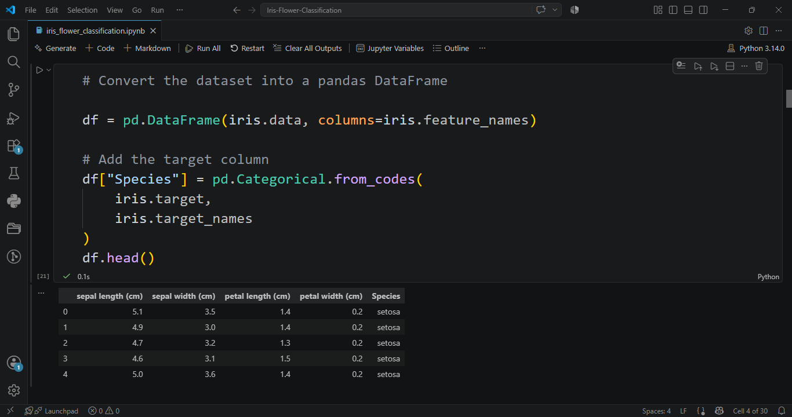
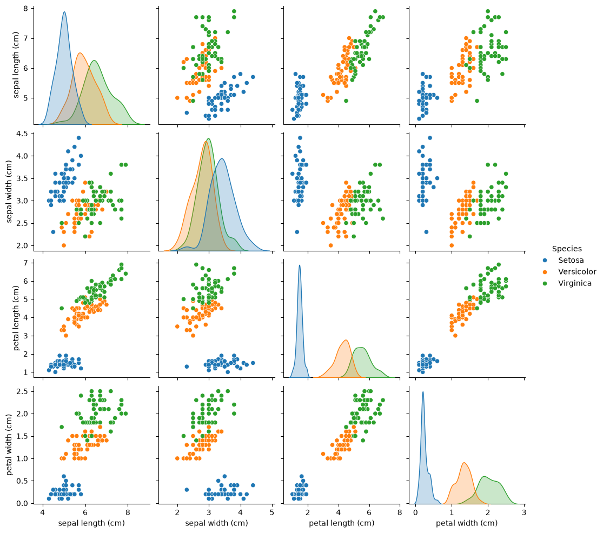
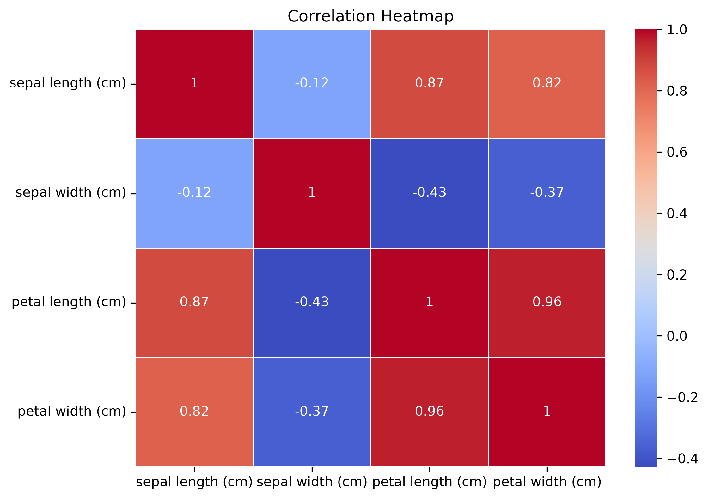
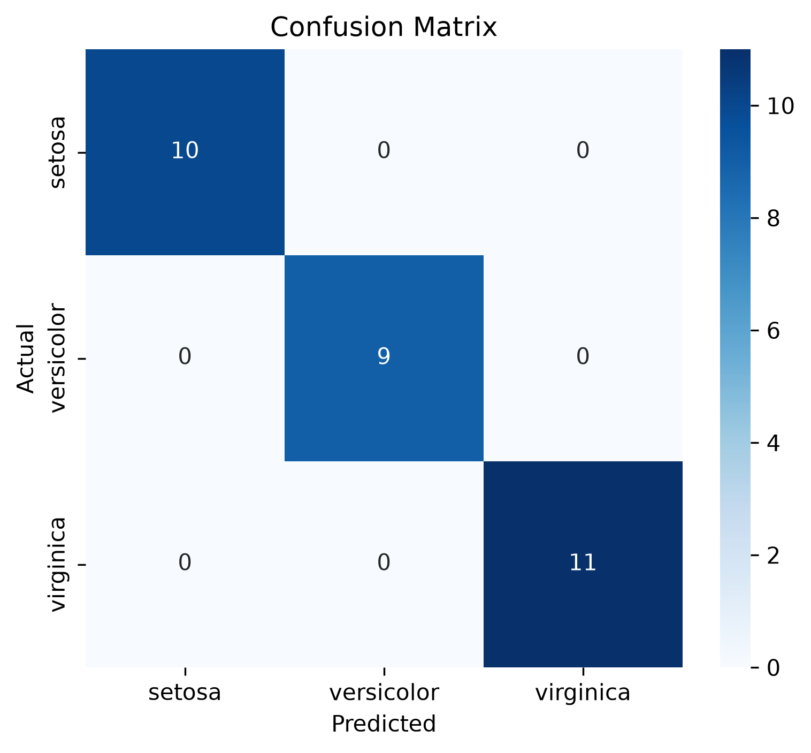
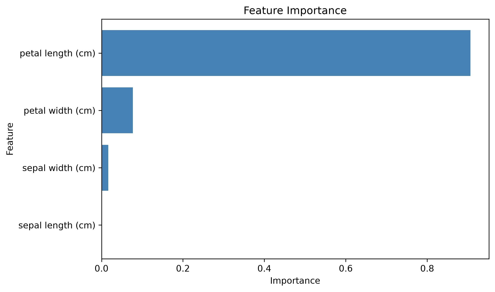

# 🌸 Iris Flower Classification

A Machine Learning project that classifies Iris flowers into three species using the Iris dataset. This project includes data preprocessing, exploratory data analysis (EDA), model training, evaluation and feature importance analysis using Python and Scikit-learn.

## 📌 Project Overview

The goal of this project is to build a classification model that predicts the species of an Iris flower based on its sepal and petal measurements.

The three species are:
- Iris Setosa
- Iris Versicolor
- Iris Virginica

## 📂 Dataset

- Dataset: Iris Dataset
- Total Samples: 150
- Features:
  - Sepal Length
  - Sepal Width
  - Petal Length
  - Petal Width
- Target:
  - Species

## 🛠️ Technologies Used

- Python
- NumPy
- Pandas
- Matplotlib
- Seaborn
- Scikit-learn
- Jupyter Notebook

## 📊 Exploratory Data Analysis

The project includes:
- Dataset overview
- Summary statistics
- Missing value check
- Pair Plot
- Correlation Heatmap
- Feature Importance

## 🤖 Machine Learning Model

Model Used:
- Decision Tree Classifier

Workflow:
1. Load Dataset
2. Data Preprocessing
3. Train-Test Split
4. Model Training
5. Model Prediction
6. Model Evaluation
7. Feature Importance Analysis

## 📈 Model Evaluation

The model is evaluated using:
- Accuracy Score
- Classification Report
- Confusion Matrix

## 📷 Project Screenshots

### Dataset Preview



### Pair Plot



### Correlation Heatmap



### Confusion Matrix



### Feature Importance



## 🚀 How to Run

1. Clone the repository

```bash
git clone https://github.com/ombhadade07-dotcom/Iris-Flower-Classification.git
```

2. Install dependencies

```bash
pip install -r requirements.txt
```

3. Open the notebook

```bash
jupyter notebook iris_flower_classification.ipynb
```

## 📄 Project Structure

```
Iris-Flower-Classification/
│
├── iris_flower_classification.ipynb
├── requirements.txt
├── README.md
└── screenshots/
```

## 👨‍💻 Author

**Om Bhadade**

GitHub: https://github.com/ombhadade07-dotcom
